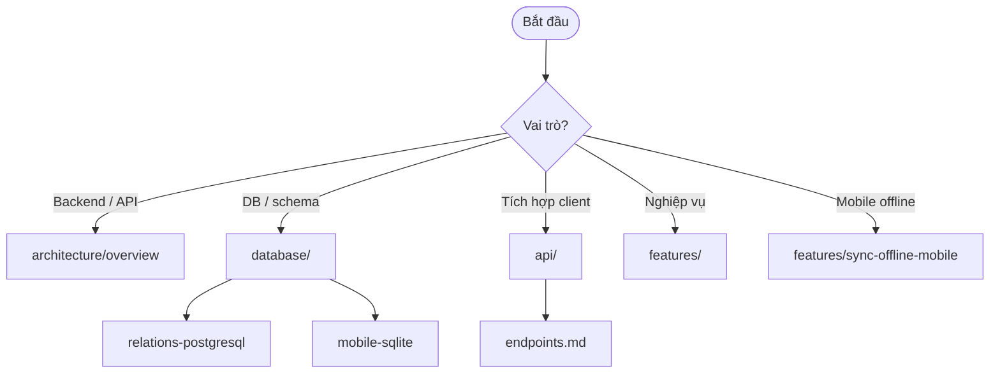

# Tài liệu Gas Store App

Bộ tài liệu kỹ thuật tiếng Việt cho monorepo **Gas Store App** (backend FastAPI, web React, mobile Expo).

## Điều hướng nhanh

## Mục lục

| Mục | Mô tả |
|-----|--------|
| [Kiến trúc tổng quan](./architecture/overview.md) | System context, auth, sync, Docker deploy |
| [Database — tổng quan](./database/overview.md) | Domain map, PostgreSQL vs SQLite |
| [Database — quan hệ bảng PostgreSQL](./database/relations-postgresql.md) | ER diagrams đầy đủ theo domain |
| [Database — SQLite mobile](./database/mobile-sqlite.md) | Schema local, sync mirror |
| [API — tổng quan](./api/overview.md) | Convention, auth modes, errors |
| [API — Auth](./api/auth.md) | Login, refresh, Bearer vs cookie |
| [API — Sync](./api/sync.md) | Pull/push offline-first |
| [API — Endpoints](./api/endpoints.md) | Bảng endpoint theo nhóm |
| [Features — index](./features/README.md) | Danh sách feature × web × mobile |

## Bắt đầu từ đâu?

| Vai trò | Đọc trước |
|---------|-----------|
| Dev backend | [architecture/overview](./architecture/overview.md) → [database/relations-postgresql](./database/relations-postgresql.md) → [api/endpoints](./api/endpoints.md) |
| Dev frontend web | [architecture/overview](./architecture/overview.md) → [api/auth](./api/auth.md) → [features/](./features/README.md) |
| Dev mobile | [architecture/overview](./architecture/overview.md) → [database/mobile-sqlite](./database/mobile-sqlite.md) → [api/sync](./api/sync.md) → [features/sync-offline-mobile](./features/sync-offline-mobile.md) |
| Vận hành / deploy | [architecture/overview](./architecture/overview.md) (phần Docker) + [README gốc](../README.md) |

## Tài liệu có sẵn (legacy)

| File | Nội dung |
|------|----------|
| [adr-mobile-sync.md](./adr-mobile-sync.md) | ADR quyết định kiến trúc sync mobile |
| [thue-va-xuat-du-lieu.md](./thue-va-xuat-du-lieu.md) | Báo cáo thuế và export CSV |
| [dashboard-feature-gate.md](./dashboard-feature-gate.md) | Feature gate dashboard admin |

## Thiết kế mobile (Figma / mockup)

- [mobile/design-system/FIGMA-STATUS.md](../mobile/design-system/FIGMA-STATUS.md)
- [mobile/design-system/pages/](../mobile/design-system/pages/)
