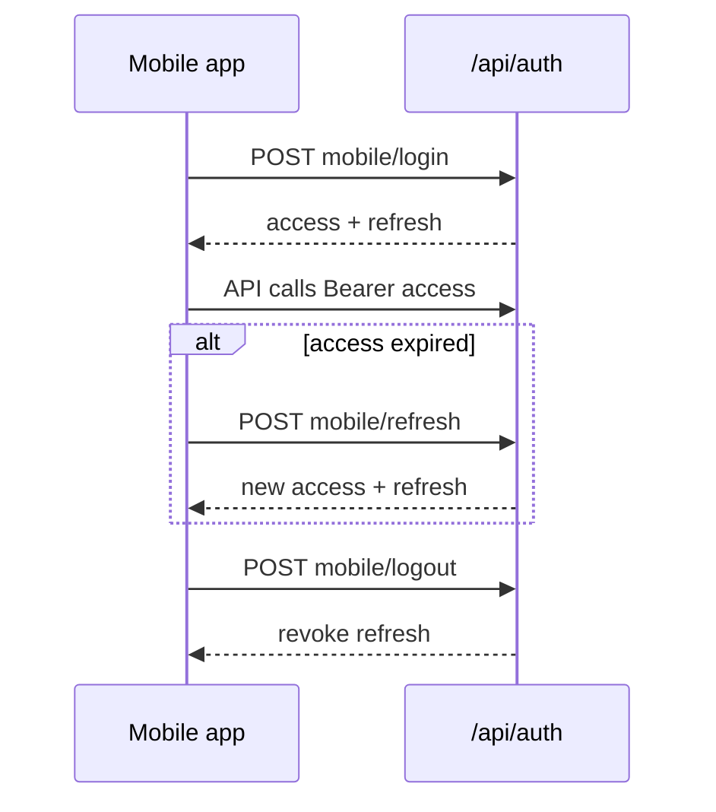

# API — Auth

Authentication và session. **Nguồn:** [backend/app/api/auth.py](../../backend/app/api/auth.py)

Prefix: `/api/auth`

## Endpoints

| Method | Path | Auth | Mô tả |
|--------|------|------|--------|
| POST | `/login` | — | Web login → Set-Cookie |
| POST | `/refresh` | refresh cookie | Web rotate tokens |
| POST | `/logout` | refresh cookie | Revoke + clear cookies |
| GET | `/me` | access | Thông tin user hiện tại |
| PATCH | `/me/map-location` | access | Lưu tọa độ map user |
| POST | `/mobile/login` | — | Mobile login → JSON tokens |
| POST | `/mobile/refresh` | — | Body `{ refresh_token }` |
| POST | `/mobile/logout` | — | Revoke refresh token |

## Web login

**Request:** `POST /api/auth/login`

```json
{ "username": "admin", "password": "admin123" }
```

**Response:** `{ "user": { "id", "username", "role", "map_location" } }` + cookies httpOnly.

## Mobile login

**Request:** `POST /api/auth/mobile/login` — cùng body.

**Response:**

```json
{
  "user": { "id": 1, "username": "...", "role": "user" },
  "access_token": "...",
  "refresh_token": "...",
  "expires_in": 3600
}
```

## Token lifecycle (mobile)



Mobile client: [mobile/src/api/client.ts](../../mobile/src/api/client.ts) — tự refresh khi 401.

## Dependencies (backend)

| Dependency | Mục đích |
|------------|----------|
| `get_current_user` | Cookie hoặc Bearer |
| `require_admin_user` | Chỉ `role=admin` |
| `require_any_role(...)` | Cho phép nhiều role |

## Bảng DB liên quan

- `users` — credential + role
- `refresh_tokens` — hash refresh, revoke, expiry

Xem [database/relations-postgresql.md](../database/relations-postgresql.md#1-auth--users).

## Liên kết

- [API overview](./overview.md)
- [Feature auth-roles](../features/auth-roles.md)
