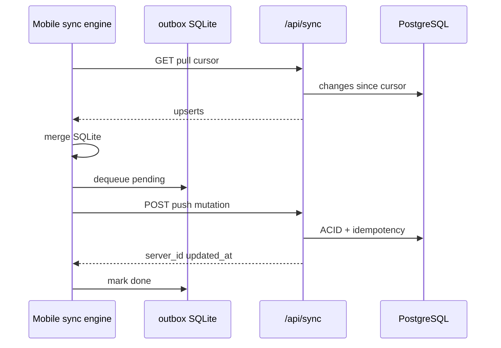

# API — Sync

Mobile offline sync pull/push. **Nguồn:** [backend/app/api/sync.py](../../backend/app/api/sync.py), [backend/app/services/sync_engine.py](../../backend/app/services/sync_engine.py)

Prefix: `/api/sync` — yêu cầu authenticated user.

## Endpoints

| Method | Path | Mô tả |
|--------|------|--------|
| GET | `/pull` | Incremental pull theo cursor |
| POST | `/push` | Áp dụng một mutation từ outbox |

## Pull

**Request:** `GET /api/sync/pull?cursor=<iso>&entities=products,sales_orders,order_notes`

| Query | Mô tả |
|-------|--------|
| `cursor` | ISO UTC timestamp; lần đầu `null` hoặc `0` |
| `entities` | Comma-separated; default `products,sales_orders,order_notes` |

**Response:**

```json
{
  "cursor": "2026-05-22T10:00:00+00:00",
  "changes": [
    {
      "entity": "sales_order",
      "op": "upsert",
      "server_id": 42,
      "client_id": "uuid-or-null",
      "updated_at": "...",
      "data": { }
    }
  ]
}
```

**Staff filter:** user không phải admin chỉ nhận đơn assigned hoặc do mình tạo; notes do mình tạo.

## Push

**Request:** `POST /api/sync/push`

```json
{
  "client_mutation_id": "uuid",
  "entity": "sales_order",
  "operation": "update",
  "server_id": 42,
  "client_id": null,
  "payload": { "delivery_status": "completed" }
}
```

**Entities hỗ trợ:**

| Entity | Operations | Ghi chú |
|--------|------------|---------|
| `sales_order` | create, update | Staff: update `completed`; admin: full create |
| `order_note` | create, update | Text note |
| `daily_cylinder_audit` | upsert | Admin kiểm kê |

**Idempotency:** `client_mutation_id` unique → `sync_applied_mutations` — replay trả kết quả cũ.

## Push/Pull sequence



## Engine lock

Mobile dùng `sync_meta` key lock — single-flight push tránh race. Xem [mobile/src/sync/engine.ts](../../mobile/src/sync/engine.ts).

## Voice upload (ngoài push)

Ghi âm: `POST /api/order-notes/voice` multipart — không qua sync push JSON.

## Liên kết

- [ADR mobile sync](../adr-mobile-sync.md)
- [Database mobile-sqlite](../database/mobile-sqlite.md)
- [Feature sync-offline-mobile](../features/sync-offline-mobile.md)
