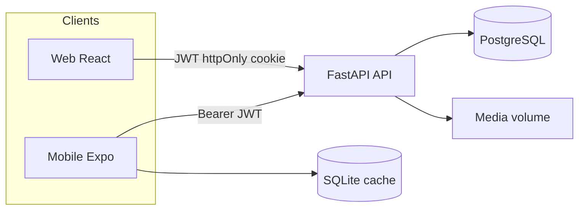
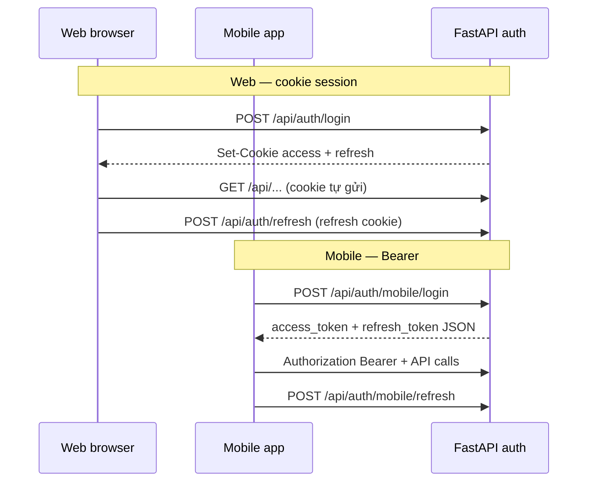
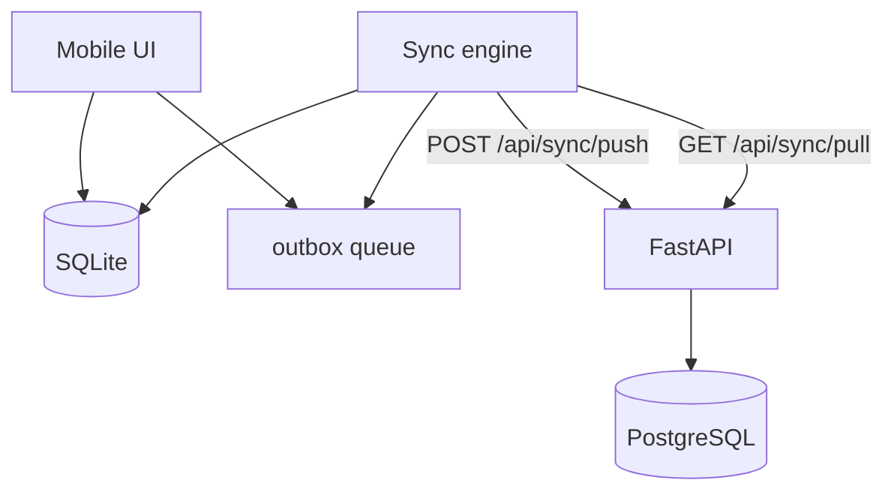
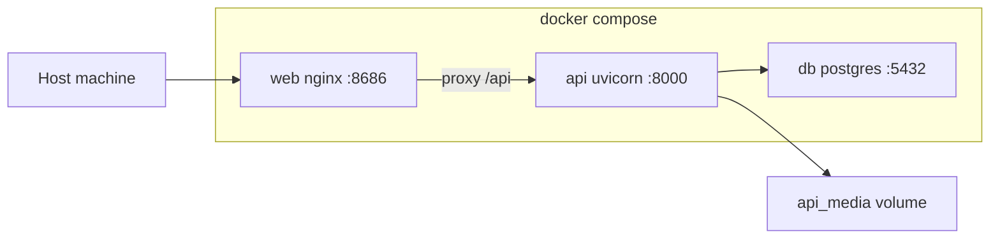

# Kiến trúc tổng quan

Gas Store App là hệ thống quản lý cửa hàng gas gồm **3 client** và **1 API** dùng chung PostgreSQL.

## Stack

| Layer | Công nghệ | Thư mục |
|-------|-----------|---------|
| API | FastAPI, SQLAlchemy, PostgreSQL | `backend/` |
| Web | Vite, React, TypeScript, shadcn/ui | `frontend/` |
| Mobile | Expo, React Native, SQLite (Drizzle) | `mobile/` |
| Deploy | Docker Compose (db + api + web) | `docker-compose.yml` |

## System context

- **Web:** session qua cookie `access_token` / `refresh_token` (httpOnly).
- **Mobile:** token JSON (`/api/auth/mobile/*`), lưu SecureStore; cache offline SQLite + outbox.
- **Media:** file ghi âm, static path `/media/...` (volume `api_media` trong Docker).

## Auth — Web vs Mobile

**Nguồn:** [backend/app/api/auth.py](../../backend/app/api/auth.py), [mobile/src/api/client.ts](../../mobile/src/api/client.ts)

### Phân quyền (RBAC)

| Role | Quyền chính |
|------|-------------|
| `admin` | Full CRUD đơn, kho, nợ, báo cáo, users |
| `user` | Tạo đơn, ghi chú; xem đơn được giao / do mình tạo |

Dependency: `get_current_user`, `require_admin_user`, `require_any_role`.

## Mobile offline-first

Luồng chính:

1. **Pull:** incremental theo `cursor` + `entities` (`products`, `sales_orders`, `order_notes`).
2. **Push:** FIFO một mutation/lần; `client_mutation_id` idempotent qua `sync_applied_mutations`.
3. **Voice:** upload multipart `/api/order-notes/voice` sau khi ghi âm local.

**UX feedback (P1):** toast toàn app — [features/mobile-ux-feedback.md](../features/mobile-ux-feedback.md).

Chi tiết: [api/sync.md](../api/sync.md), [adr-mobile-sync.md](../adr-mobile-sync.md), [features/sync-offline-mobile.md](../features/sync-offline-mobile.md).

## Deploy Docker

| Service | Port mặc định | Ghi chú |
|---------|---------------|---------|
| `web` | 8686 | Static UI + proxy API |
| `api` | 8000 | FastAPI, `/docs` OpenAPI |
| `db` | 5432 | Postgres 16 |

Khởi động: `./setup.sh` hoặc `docker compose up --build` — xem [README gốc](../../README.md).

## Liên kết

- [Database overview](../database/overview.md)
- [API overview](../api/overview.md)
- [Features index](../features/README.md)
