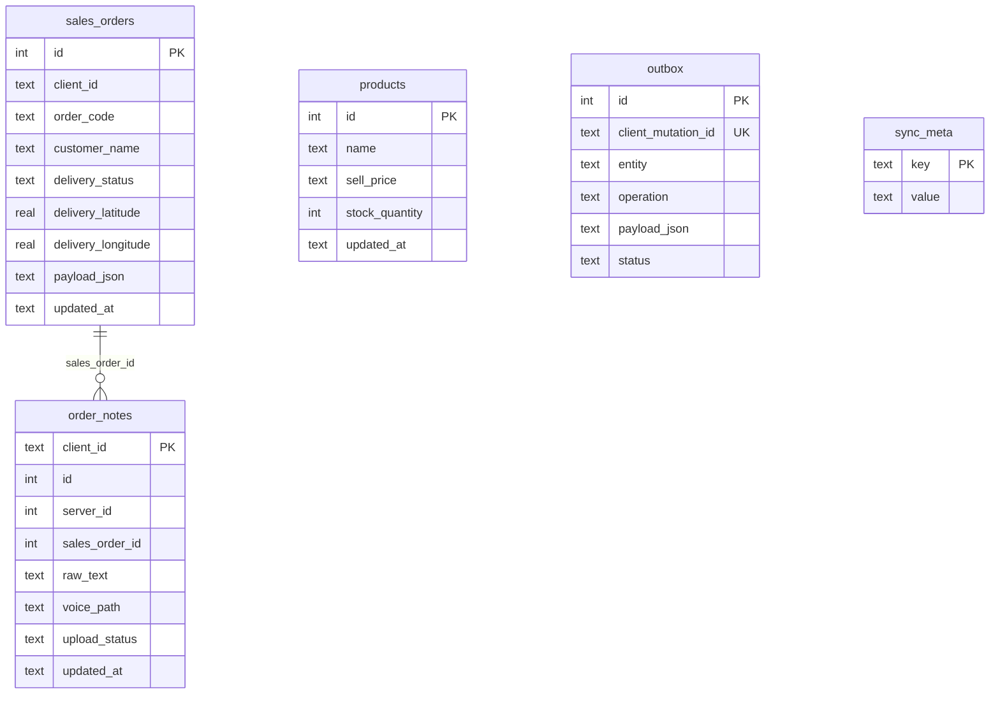
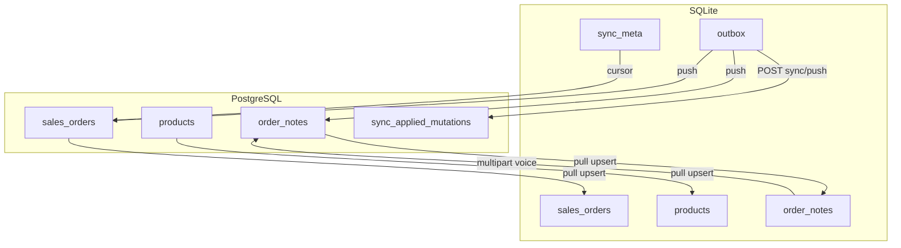

# SQLite mobile — Schema & sync mirror

Schema local cho app Expo offline-first. **Nguồn:** [mobile/src/db/schema.ts](../../mobile/src/db/schema.ts), [mobile/src/db/client.ts](../../mobile/src/db/client.ts).

## ER logical (local)

SQLite không khai báo FK enforced trong Drizzle — quan hệ **logical** qua app code.

### Bảng `sales_orders`

| Cột | Kiểu | Mô tả |
|-----|------|--------|
| `id` | integer PK | Server id sau pull |
| `client_id` | text | UUID client (sync create) |
| `order_code` | text | Mã đơn hiển thị |
| `delivery_status` | text | `in_transit` / `completed` |
| `delivery_address` | text | Địa chỉ giao |
| `delivery_latitude/longitude` | real | Tọa độ chỉ đường |
| `payload_json` | text | Snapshot JSON đầy đủ từ pull |
| `borrowed_shell_units` | integer | Vỏ mượn trên đơn |

### Bảng `order_notes`

| Cột | Kiểu | Mô tả |
|-----|------|--------|
| `client_id` | text PK | Idempotent key local |
| `server_id` | integer | Id server sau sync |
| `sales_order_id` | integer | Liên kết đơn (logical FK) |
| `voice_path` | text | File local trước upload |
| `upload_status` | text | `pending` / `uploaded` / `failed` |

### Bảng `outbox`

FIFO queue mutation offline — một mutation active tại một thời điểm (single-flight push).

| Cột | Mô tả |
|-----|--------|
| `client_mutation_id` | Unique — map `sync_applied_mutations` server |
| `entity` | `sales_order`, `order_note`, `daily_cylinder_audit` |
| `operation` | `create`, `update` |
| `status` | `pending`, `processing`, `done`, `failed` |

### Bảng `sync_meta`

Key-value: pull `cursor`, engine lock, v.v.

## Sync mirror — server ↔ mobile

### Mapping cột chính

| Server (PostgreSQL) | Mobile (SQLite) | Hướng |
|--------------------|-----------------|-------|
| `sales_orders.*` | `sales_orders` + `payload_json` | Pull |
| `products.*` | `products` | Pull |
| `order_notes.*` | `order_notes` | Pull + Push |
| `delivery_status` update | outbox → push | Push (staff complete) |
| Voice `audio_path` | `voice_path` + HTTP upload | Push riêng |

### Pull filter (staff)

Staff chỉ pull đơn được assign hoặc do mình tạo — logic server: [sync_engine.py](../../backend/app/services/sync_engine.py) `_staff_order_filter`.

## Liên kết

- [API Sync](../api/sync.md)
- [Feature sync offline](../features/sync-offline-mobile.md)
- [ADR mobile sync](../adr-mobile-sync.md)
- [PostgreSQL ER](./relations-postgresql.md)
