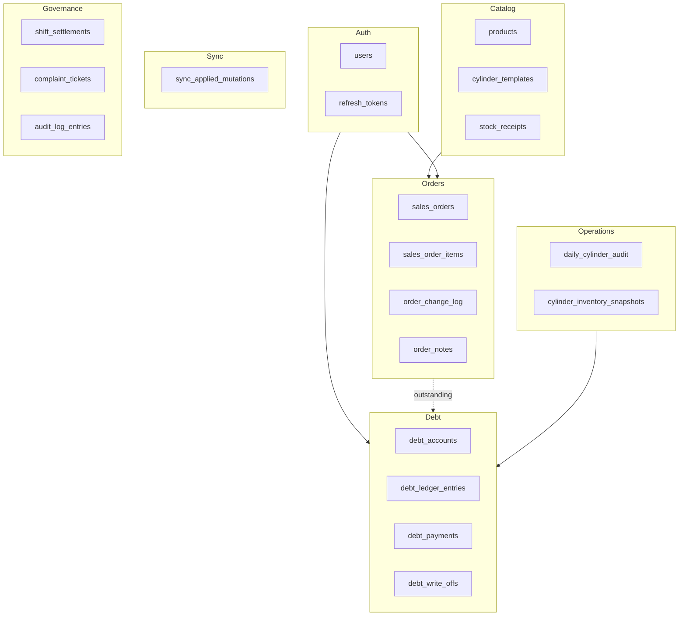

# Database — Tổng quan

Gas Store dùng **PostgreSQL** làm nguồn sự thật (server) và **SQLite** trên mobile làm cache offline.

## PostgreSQL vs SQLite

| | PostgreSQL (server) | SQLite (mobile) |
|--|-------------------|-----------------|
| Vai trò | Source of truth | Cache + outbox queue |
| ORM / schema | SQLAlchemy [models.py](../../backend/app/models.py) | Drizzle [schema.ts](../../mobile/src/db/schema.ts) |
| Phạm vi bảng | ~25 bảng (full domain) | 5 bảng (subset sync) |
| FK | Enforced DB | Logical (app-level) |

## Domain map

## Bảng theo domain

| Domain | Bảng | ER chi tiết |
|--------|------|-------------|
| Auth | `users`, `refresh_tokens` | [§1 Auth](./relations-postgresql.md#1-auth--users) |
| Catalog | `products`, `stock_receipts`, `cylinder_templates` | [§2 Catalog](./relations-postgresql.md#2-catalog--inventory) |
| Orders | `sales_orders`, `sales_order_items`, `order_change_log` | [§3 Orders](./relations-postgresql.md#3-orders-core) |
| Notes | `order_notes` | [§4 Notes](./relations-postgresql.md#4-order-notes) |
| Debt | `debt_accounts`, `debt_ledger_entries`, `debt_payments`, `debt_write_offs` | [§5 Debt](./relations-postgresql.md#5-debt--finance) |
| Ops | `daily_cylinder_audit`, `cylinder_inventory_snapshots` | [§6 Ops](./relations-postgresql.md#6-operations--audit) |
| Sync | `sync_applied_mutations` | [§7 Sync](./relations-postgresql.md#7-sync-idempotency) |
| Governance | shift settlements, KPI, complaints, safety, CAPA, audit logs | [§8 Governance](./relations-postgresql.md#8-governance-admin-dashboards) |

## Migration

- Chạy additive migration khi API khởi động: [schema_migrate.py](../../backend/app/schema_migrate.py).
- Không có migration file Alembic riêng — thêm cột/bảng qua code migrate.

## Mobile local schema

Xem [mobile-sqlite.md](./mobile-sqlite.md) — mirror `sales_orders`, `products`, `order_notes` + `outbox`, `sync_meta`.

## Liên kết

- [Quan hệ bảng PostgreSQL (ER đầy đủ)](./relations-postgresql.md)
- [SQLite mobile](./mobile-sqlite.md)
