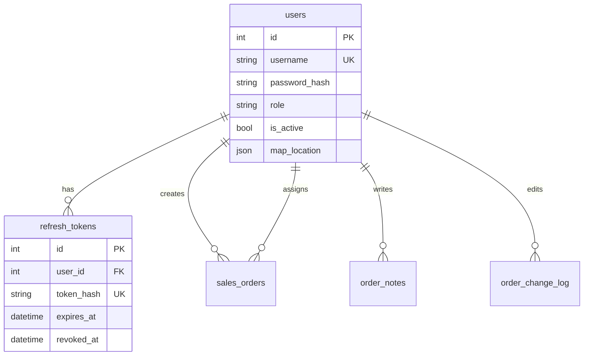
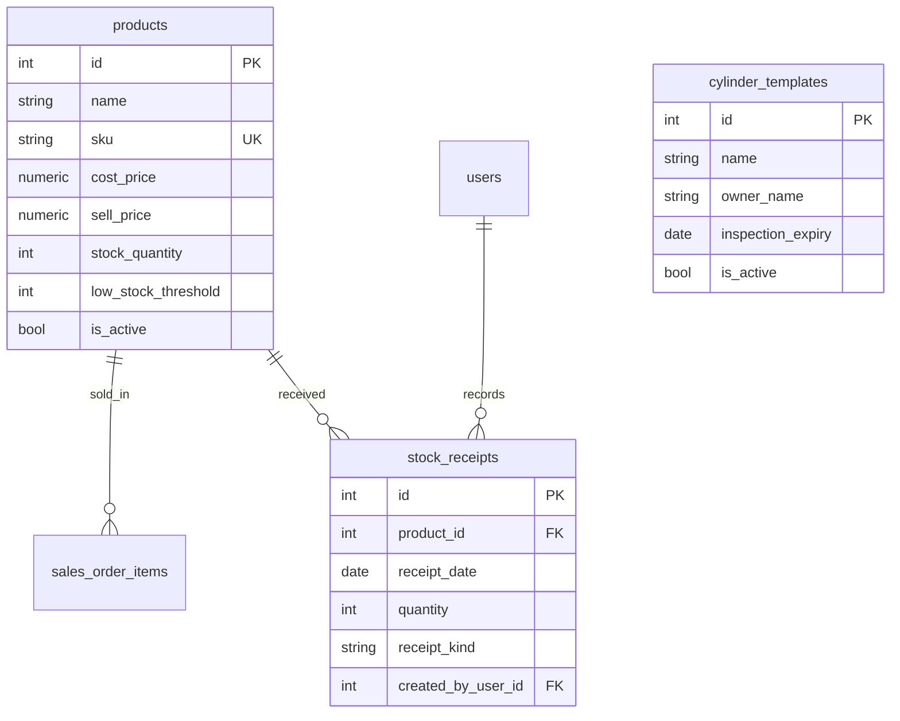
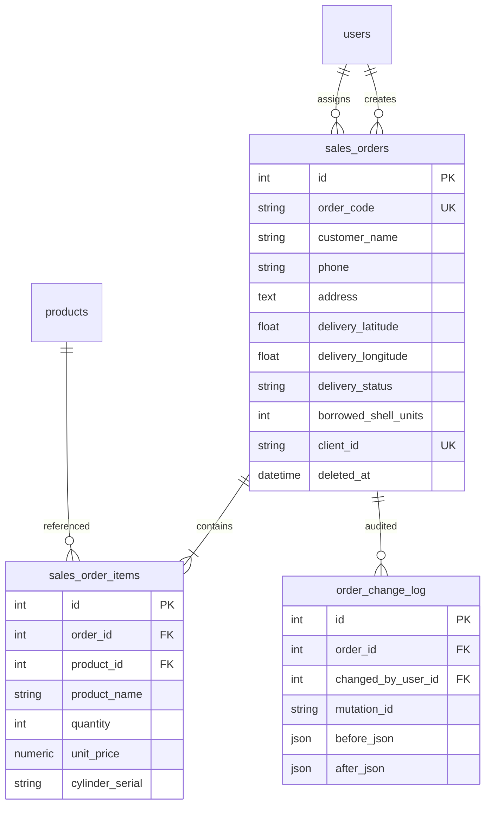
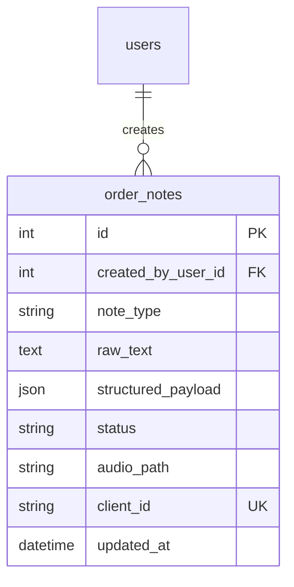
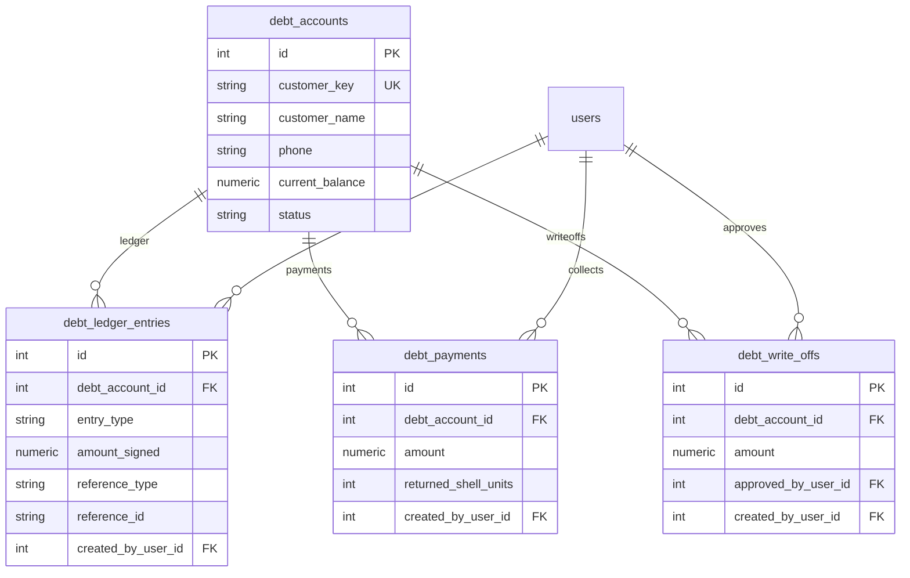
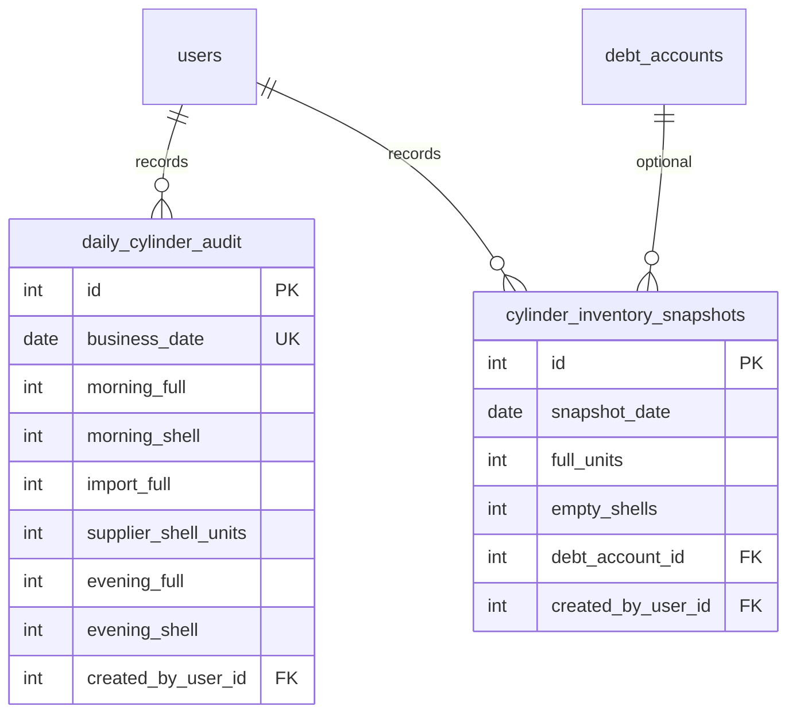
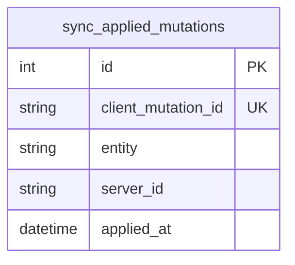
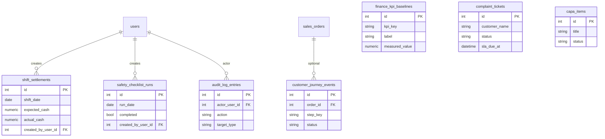

# Quan hệ bảng PostgreSQL

Sơ đồ ER và bảng FK cho schema server. **Nguồn:** [backend/app/models.py](../../backend/app/models.py).

---

## 1. Auth & Users

| Cột FK | Bảng đích | Ghi chú |
|--------|-----------|---------|
| `refresh_tokens.user_id` | `users.id` | Cascade delete tokens khi xóa user (ORM) |
| `sales_orders.created_by_user_id` | `users.id` | Nullable |
| `sales_orders.assigned_to_user_id` | `users.id` | Nullable — nhân viên giao |
| `order_notes.created_by_user_id` | `users.id` | NOT NULL |
| `order_change_log.changed_by_user_id` | `users.id` | Nullable |

---

## 2. Catalog & Inventory

| Cột FK | Bảng đích | Ghi chú |
|--------|-----------|---------|
| `stock_receipts.product_id` | `products.id` | NOT NULL |
| `stock_receipts.created_by_user_id` | `users.id` | Nullable |
| `sales_order_items.product_id` | `products.id` | NOT NULL |

`cylinder_templates` không có FK — preset cho UI tạo dòng đơn (serial nhập tay).

**`receipt_kind`:** `opening` (baseline, không cộng tồn lần nữa) | `inbound` (nhập kho).

---

## 3. Orders (core)

| Cột FK | Bảng đích | On delete |
|--------|-----------|-----------|
| `sales_order_items.order_id` | `sales_orders.id` | — |
| `order_change_log.order_id` | `sales_orders.id` | **CASCADE** |

**Index/UK quan trọng:** `order_code` (unique), `client_id` (unique, sync mobile), `delivery_status`.

**`delivery_status`:** `in_transit` | `completed`.

---

## 4. Order notes

| Cột FK | Bảng đích | Ghi chú |
|--------|-----------|---------|
| `order_notes.created_by_user_id` | `users.id` | NOT NULL |

**Enums:** `note_type` (`text` | `voice`), `status` (`draft` | `converted` | `archived`).

Không có FK trực tiếp tới `sales_orders` trên server — liên kết đơn qua `structured_payload` hoặc UI; mobile dùng `sales_order_id` local.

---

## 5. Debt & finance

| Cột FK | Bảng đích |
|--------|-----------|
| `debt_ledger_entries.debt_account_id` | `debt_accounts.id` |
| `debt_payments.debt_account_id` | `debt_accounts.id` |
| `debt_write_offs.debt_account_id` | `debt_accounts.id` |
| `debt_write_offs.approved_by_user_id` | `users.id` |

**`customer_key`:** số điện thoại chuẩn hóa (unique). Ledger `amount_signed`: dương = tăng nợ, âm = giảm nợ.

---

## 6. Operations & audit

| Bảng | Ghi chú |
|------|---------|
| `daily_cylinder_audit` | Một row / `business_date` (unique) — kiểm kê vỏ/bình theo ngày |
| `cylinder_inventory_snapshots` | Legacy; API mới dùng `daily_cylinder_audit` |

Công thức kỳ vọng vỏ cuối ngày tích hợp `borrowed_shell_units` (đơn) và `returned_shell_units` (thu nợ).

---

## 7. Sync idempotency

Bảng độc lập — không FK. Mỗi push mobile ghi một row để tránh replay mutation.

---

## 8. Governance (admin dashboards)

| Bảng | FK chính |
|------|----------|
| `shift_settlements` | `created_by_user_id` → `users` |
| `customer_journey_events` | `order_id` → `sales_orders` (nullable) |
| `safety_checklist_runs` | `created_by_user_id` → `users` |
| `audit_log_entries` | `actor_user_id` → `users` |

`finance_kpi_baselines`, `complaint_tickets`, `capa_items` — không FK bắt buộc tới bảng nghiệp vụ khác.

---

## Migration

Schema cập nhật **additive** lúc startup qua [backend/app/schema_migrate.py](../../backend/app/schema_migrate.py) — không dùng Alembic riêng.

## Liên kết

- [Database overview](./overview.md)
- [Mobile SQLite](./mobile-sqlite.md)
