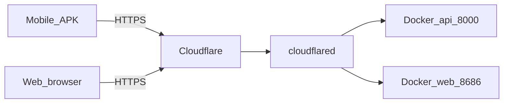

# Cloudflare Tunnel — production deploy

Expose the Gas Store Docker stack over HTTPS with a fixed domain (replaces ngrok).

## Architecture



## DNS (example)

| Subdomain | Cloudflare proxy | Tunnel origin | Purpose |
|-----------|------------------|---------------|---------|
| `api.<domain>` | Proxied (orange cloud) | `http://127.0.0.1:8000` | Mobile + API |
| `app.<domain>` | Proxied | `http://127.0.0.1:8686` | Web admin (optional) |

Replace `<domain>` with your registered domain.

## Setup checklist

1. Buy domain and add site to Cloudflare; point registrar nameservers to Cloudflare.
2. First boot on the host (admin credentials → `.env`, not in git):

```bash
./setup.sh --admin-user shopadmin --admin-pass 'YourStrongPass!' \
  --cors 'https://app.gashuyhoang.io.vn,https://gashuyhoang.io.vn'
```

3. **Zero Trust → Networks → Tunnels** → Create tunnel → install `cloudflared` on the host running Docker.
4. Add public hostnames:
   - `api.gashuyhoang.io.vn` → `http://localhost:8000`
   - `app.gashuyhoang.io.vn` → `http://localhost:8686` (optional)
5. SSL/TLS mode: **Full** (HTTP origin behind tunnel is OK).
6. Stop ngrok when tunnel is stable.

## Environment variables

| Variable | Production value | Where |
|----------|------------------|-------|
| `EXPO_PUBLIC_API_URL` | `https://api.<domain>` | GitHub secret + mobile release build |
| `CORS_ORIGINS` | `https://app.<domain>,https://<domain>` | `.env` / `docker-compose.yml` |
| `VITE_API_BASE` | `` (empty) or `https://api.<domain>` | Web Docker build args |

**Mobile:** HTTPS only, no trailing slash, do not bake ngrok URLs into release APK.

**Backend:** update `CORS_ORIGINS` in [`docker-compose.yml`](../../docker-compose.yml) or host `.env`:

```bash
CORS_ORIGINS=https://app.example.com,https://example.com
```

## Verify

```bash
curl -sI https://api.<domain>/docs | head -1
# HTTP/2 200
```

Login from mobile APK built with `EXPO_PUBLIC_API_URL=https://api.<domain>`.

## Minimum server (reference)

| Resource | Minimum | Recommended |
|----------|---------|-------------|
| CPU | 1 vCPU | 1–2 vCPU |
| RAM | 1 GB (after images built) | 2 GB |
| Disk | 10 GB SSD | 20 GB SSD |

Run `cloudflared` on the same host as Docker Compose.

## Troubleshooting

- **502 from Cloudflare:** Docker not running or wrong tunnel origin port.
- **CORS errors on web:** add web origin to `CORS_ORIGINS` and restart `api` container.
- **Mobile login fails:** confirm APK was built with HTTPS API URL; release builds disable cleartext HTTP.
