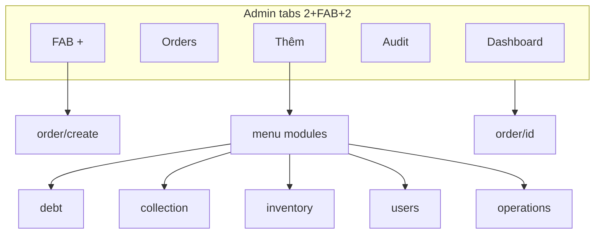

# Admin Mobile

Navigation và module admin trên Expo.

## Mục đích

- Dashboard, đơn hàng, kiểm kê trên mobile.
- Menu module P2: nợ, thu nợ, kho, users, vận hành.

## Actor

Role `admin`.

## Nav structure

## API

Admin endpoints + sync pull (full orders scope).

→ [endpoints.md](../api/endpoints.md)

## Mobile routes

| Path | File |
|------|------|
| `(admin)/(tabs)/index` | Dashboard |
| `(admin)/(tabs)/orders` | Order list |
| `(admin)/(tabs)/audit` | Cylinder audit |
| `(admin)/(tabs)/more` | Tab Thêm — P2 modules |
| `(admin)/order/[id]` | Order detail/edit |
| `(admin)/order/create` | Create order (FAB) |
| `(admin)/menu` | Module menu |
| `(admin)/module/*` | debt, collection, inventory, users, operations |

Layout: [mobile/app/(admin)/_layout.tsx](../../mobile/app/(admin)/_layout.tsx)

## Features code

[mobile/src/features/admin/](../../mobile/src/features/admin/)

### P1 admin CRUD (online-first)

| Module | Thao tác | Ghi chú |
|--------|----------|---------|
| Dashboard | Kéo xuống đồng bộ | `RefreshControl` + `manualSyncAndReload`; toast |
| Orders list | Search, sort mới nhất, pull sync | Client filter trên SQLite; caption sync |
| Orders list | Hoàn thành nhanh, +1 vỏ | PATCH online; toast |
| Create order | FAB → 2-step form | POST online hoặc outbox; địa chỉ + Maps/GPS |
| Order detail | Tab **Sửa**: status, phone, note, assign | `patchOrder` + `buildOrderPatchPayload` |
| Audit tab | GET load, PUT save, offline outbox | Computed variance read-only |
| Module debt | Bottom sheet thu nợ | `POST /debt-payments` |

Toast: [mobile-ux-feedback.md](./mobile-ux-feedback.md)

## Design

- [FIGMA-STATUS.md](../../mobile/design-system/FIGMA-STATUS.md)
- Mockups: `mobile/design-system/figma-mockup/`

## Edge cases

- Admin tạo đơn qua sync push `sales_order` create.
- Outbox screen shared với staff: `/outbox`
- Tab **Đơn hàng**: search mã/khách/SĐT trên cache; kéo xuống hoặc nút **Đồng bộ** gọi `runSyncCycle` (không auto-sync sau login).
- Tab **Tổng quan**: pull refresh tương tự — KPI đọc lại SQLite sau sync.

Design v5.3: [FIGMA-STATUS.md](../../mobile/design-system/FIGMA-STATUS.md) node 35:2.
