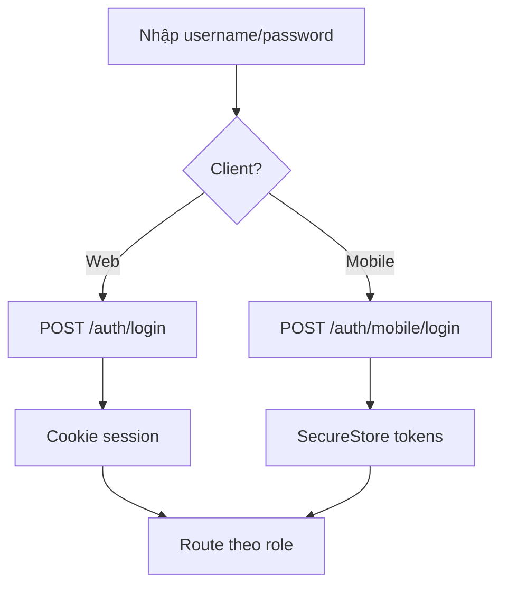

# Auth & Roles

Đăng nhập và phân quyền RBAC (`admin` / `user`).

## Mục đích

- Xác thực user cho web (cookie) và mobile (Bearer).
- Giới hạn API theo role — backend là nguồn sự thật.

## Actor

| Role | Web | Mobile |
|------|-----|--------|
| admin | Full sidebar | Admin tabs + menu modules |
| user | Staff nav | Staff tabs (đơn giao) |

## Luồng đăng nhập

## API

→ [api/auth.md](../api/auth.md)

## DB

- `users`, `refresh_tokens` — [relations §1](../database/relations-postgresql.md#1-auth--users)

## Web

- Login page React; không lưu token localStorage.
- Admin vs staff nav: [navGroups.ts](../../frontend/src/lib/navGroups.ts)

## Mobile

- [mobile/app/login.tsx](../../mobile/app/login.tsx)
- Session expired → redirect login

## Edge cases

- User `is_active=false` → 401.
- Mobile refresh fail → logout + login lại.
