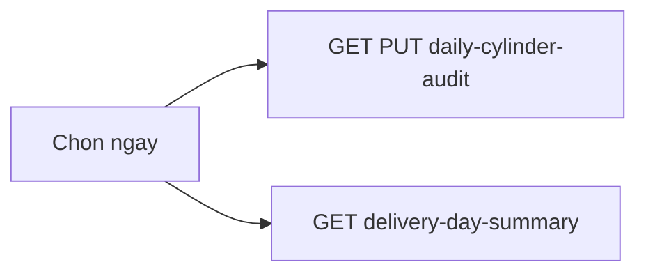

# Daily operations (điều hành)

Trang vận hành hằng ngày: kiểm kê nước/vỏ theo ngày giao + danh sách đơn cùng ngày.

## Mục đích

- Một lịch chọn `business_date` / ngày giao.
- Tab kiểm kê: upsert `daily_cylinder_audit`, so variance kỳ vọng.
- Tab đơn: đơn có `delivery_date` trong ngày đã chọn (đơn không có ngày giao không hiện — sửa trên `/don-hang`).

## Actor

Admin.

## Luồng

## API

| Method | Path |
|--------|------|
| GET / PUT | `/operations/daily-cylinder-audit` |
| GET | `/operations/delivery-day-summary?dates=` (CSV `YYYY-MM-DD`) |

Công thức kiểm kê: [gas-ledger-audit.md](./gas-ledger-audit.md).

## Web

- `/dieu-hanh` — [CoreOperations.tsx](../../frontend/src/pages/CoreOperations.tsx)
  - Tab **Kiểm kê nước / vỏ**
  - Tab **Đơn theo ngày giao**

## Mobile

Kiểm kê: tab audit — cùng API GET/PUT (offline qua outbox). Không có màn “delivery-day-summary” trên mobile.

## Liên kết

- Sổ gas CSV: `/so-gas` — [gas-ledger-audit.md](./gas-ledger-audit.md)
