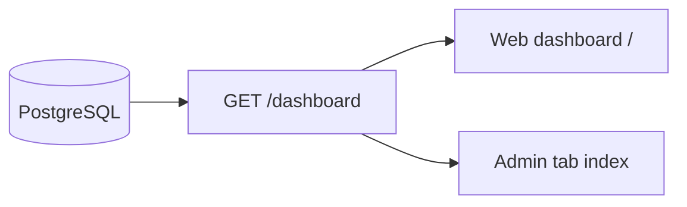

# Dashboard & Reports

Tổng quan KPI và báo cáo vận hành admin.

## Mục đích

- Dashboard chart-first: doanh thu, đơn, tồn, cảnh báo.
- Governance widgets: shift settlement, complaints, safety, CAPA.

## Actor

Admin.

## Data flow

## API

| Method | Path |
|--------|------|
| GET | `/dashboard` |
| GET/POST | `/shift-settlements`, `/finance-kpis`, ... |

→ [endpoints.md](../api/endpoints.md) — Dashboard & governance

## DB

- Governance tables — [relations §8](../database/relations-postgresql.md#8-governance-admin-dashboards)

## Web

- `/` — dashboard chính

## Mobile

- [mobile/app/(admin)/(tabs)/index.tsx](../../mobile/app/(admin)/(tabs)/index.tsx)
- KPI chart: **ưu tiên `GET /dashboard`** khi online (gom `created_at` như web); offline fallback SQLite (`sales_orders.created_at`, tối đa 30 ngày).
- KPI **Hôm nay**: doanh thu + số đơn theo `created_at`, so sánh % vs hôm qua.
- Widget trạng thái giao / nợ vỏ / tồn: vẫn từ cache local.

## Feature gate

→ [dashboard-feature-gate.md](../dashboard-feature-gate.md)
