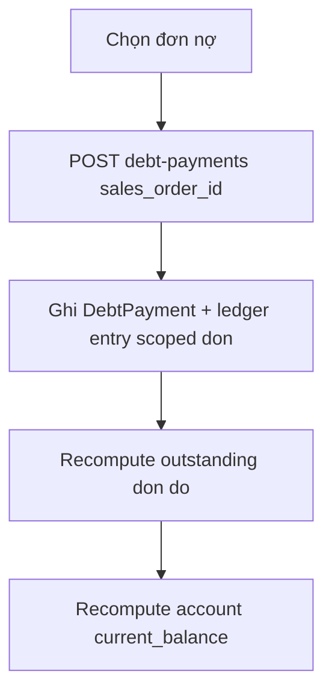

# Debt & Finance

Công nợ khách hàng, thu nợ, xóa nợ. Outstanding **theo từng đơn**, không phân bổ FIFO theo SĐT.

## Mục đích

- Tài khoản nợ (`debt_accounts`) keyed bởi `customer_key` (SĐT chuẩn hóa) — cache số dư.
- Ledger bất biến; mỗi khoản thu/ghi nợ gắn `sales_order_id`.
- `current_balance` trên account = tổng `outstanding_amount` các đơn active cùng SĐT.

## Actor

Chỉ **admin**.

## Luồng thu nợ

`POST /debt-payments` yêu cầu `sales_order_id`. Số tiền không được vượt `outstanding_amount` của **đơn đó**.

Backfill DB cũ: `backfill_order_debt_links` gắn `sales_order_id` cho ledger/payment legacy (một lần lúc migrate).

## API

| Method | Path |
|--------|------|
| GET | `/debt-orders`, `/debt-orders/{id}` |
| GET | `/debt-accounts`, `/debt-accounts/{id}`, `/debt-accounts/{id}/ledger` |
| GET | `/shell-debt-ledger`, `/shell-debt-ledger.csv` |
| POST/PATCH/DELETE | `/debt-payments` |
| POST | `/debt-write-offs` |
| GET | `/debt-aging` |

Query list đơn nợ: `status` (`all` / `open` / `paid`), `month` (`YYYY-MM` theo ngày giao), `search`.

→ [endpoints.md](../api/endpoints.md)

## DB

- [relations §5](../database/relations-postgresql.md#5-debt--finance)
- Helpers: [backend/app/services/debt_orders.py](../../backend/app/services/debt_orders.py)

## Web

- `/tai-chinh-quan-tri` — tab **Tổng quan**, **Sổ nợ** (list `GET /debt-orders`, chi tiết + thu nợ theo đơn), **Sổ nợ vỏ** (đơn có `borrowed_shell_units > 0`, export CSV/PDF/Excel)

## Mobile

- [module/debt.tsx](../../mobile/app/(admin)/module/debt.tsx) — list + **Thu nợ** bottom sheet (P1)
- [module/collection.tsx](../../mobile/app/(admin)/module/collection.tsx) — nợ vỏ từ cache đơn
- [DebtPaymentSheet](../../mobile/src/components/ui/DebtPaymentSheet.tsx) → `POST /debt-payments` với `sales_order_id` (online only)

## Edge cases

- `returned_shell_units` trên payment ảnh hưởng kiểm kê vỏ cuối ngày.
- Tạo đơn `payment_mode` công nợ / partial → ledger invoice gắn đơn đó.
- Row ledger cũ không có `sales_order_id` vẫn match qua `reference_type=sales_order` + `reference_id`.
