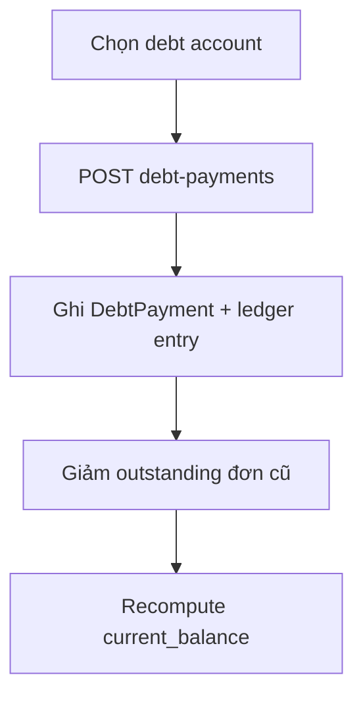

# Debt & Finance

Công nợ khách hàng, thu nợ, xóa nợ.

## Mục đích

- Tài khoản nợ theo `customer_key` (SĐT chuẩn hóa).
- Ledger bất biến; thu nợ giảm nợ cũ nhất trước.

## Actor

Chỉ **admin**.

## Luồng thu nợ

## API

| Method | Path |
|--------|------|
| GET | `/debt-accounts`, `/debt-accounts/{id}` |
| GET | `/shell-debt-ledger`, `/shell-debt-ledger.csv` |
| POST/PATCH/DELETE | `/debt-payments` |
| POST | `/debt-write-offs` |
| GET | `/debt-aging` |

## DB

- [relations §5](../database/relations-postgresql.md#5-debt--finance)

## Web

- `/tai-chinh-quan-tri` — tab **Tổng quan**, **Sổ nợ** (tiền), **Sổ nợ vỏ** (đơn có `borrowed_shell_units > 0`, export CSV/PDF/Excel)

## Mobile

- [module/debt.tsx](../../mobile/app/(admin)/module/debt.tsx) — list + **Thu nợ** bottom sheet (P1)
- [module/collection.tsx](../../mobile/app/(admin)/module/collection.tsx) — nợ vỏ từ cache đơn
- [DebtPaymentSheet](../../mobile/src/components/ui/DebtPaymentSheet.tsx) → `POST /debt-payments` (online only)

## Edge cases

- `returned_shell_units` trên payment ảnh hưởng kiểm kê vỏ cuối ngày.
- Tạo đơn công nợ → auto ledger invoice.
