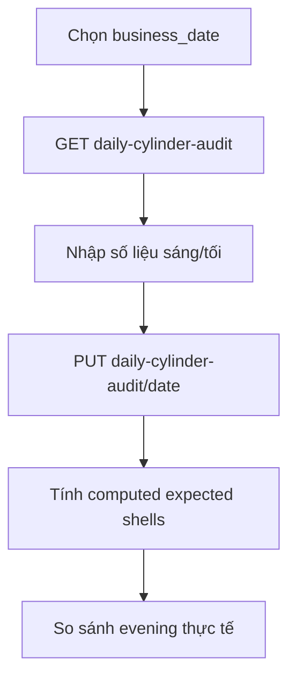
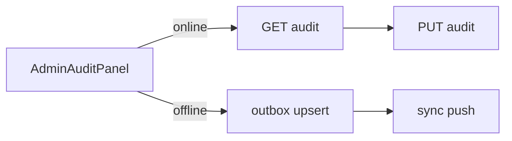

# Gas Ledger & Audit

Sổ gas và kiểm kê bình/vỏ theo ngày (UTC+7 business date).

## Mục đích

- Sổ gas: xuất/nhập bình theo đơn và vận hành.
- Kiểm kê cuối ngày: morning/evening counts + nhập từ NCC + vỏ trả nợ.

## Actor

Admin (web + mobile audit tab).

## Luồng kiểm kê

## API

| Method | Path |
|--------|------|
| GET | `/gas-ledger`, `/gas-ledger.csv` |
| GET/PUT | `/operations/daily-cylinder-audit` |

## DB

- `daily_cylinder_audit`, `cylinder_inventory_snapshots` (legacy) — [relations §6](../database/relations-postgresql.md#6-operations--audit)

## Web

- `/so-gas`, `/dieu-hanh`

## Mobile

- [mobile/app/(admin)/(tabs)/audit.tsx](../../mobile/app/(admin)/(tabs)/audit.tsx)
- **Load:** `GET /operations/daily-cylinder-audit?audit_date=` (online) — pre-fill form, bỏ default cứng.
- **Save online:** `PUT /operations/daily-cylinder-audit/{date}` — hiển thị `computed` variance.
- **Save offline:** outbox `daily_cylinder_audit` upsert + toast "xếp hàng".

## Edge cases

- Công thức vỏ kỳ vọng gồm `borrowed_shell_units` (đơn) + `returned_shell_units` (thu nợ).

## Trường bắt buộc sổ gas (2026-05)

**Đơn (header):** SĐT, địa chỉ, ngày giao.

**Dòng hàng (line):** chủ sở hữu, loại chai, hạn kiểm định, nơi nhập, ngày nhập.

**Không bắt buộc:** `cylinder_serial` — cột vẫn hiển thị trên web/CSV khi có dữ liệu.

Logic: [backend/app/services/gas_ledger_rules.py](../../backend/app/services/gas_ledger_rules.py). API trả `gas_ledger_ready` + `gas_ledger_gaps` trên order response.
