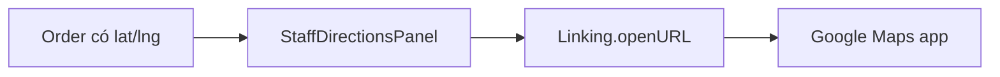

# Geocode & Maps

Geocoding địa chỉ và chỉ đường giao hàng.

## Mục đích

- Chuyển địa chỉ ↔ tọa độ cho đơn hàng.
- Mobile mở **Google Maps** deep link (không embed map SDK in-app).

## Actor

Admin (web order form); staff (mobile directions).

## Luồng chỉ đường mobile

URL pattern: `https://www.google.com/maps/dir/?api=1&destination=lat,lng`

## API

| Method | Path |
|--------|------|
| GET | `/geocode` |
| GET | `/geocode/reverse` |
| POST | `/geocode/from-paste` |
| PATCH | `/auth/me/map-location` |

## DB

- `sales_orders.delivery_latitude/longitude`
- `users.map_location`

## Web

- Map trong form đơn; `/ban-do` staff

## Mobile

- Tab **Điểm giao**: [directions.tsx](../../mobile/app/(staff)/(tabs)/directions.tsx)
- Utils: [mobile/src/utils/maps.ts](../../mobile/src/utils/maps.ts), [order-location.ts](../../mobile/src/lib/order-location.ts)
- Toast khi không mở được Maps/Gọi — [mobile-ux-feedback.md](./mobile-ux-feedback.md)

### Android manifest (P1)

`mobile/android/app/src/main/AndroidManifest.xml` — `<queries>` cho `tel:` (DIAL) và `https` (Maps).

## Edge cases

- Thiếu tọa độ → geocode từ địa chỉ text trước khi mở Maps.
- Không dùng map SDK trong app (Figma v4 quyết định).
- **Emulator:** thường không có app Phone → `tel:` fail; test gọi trên máy thật.
