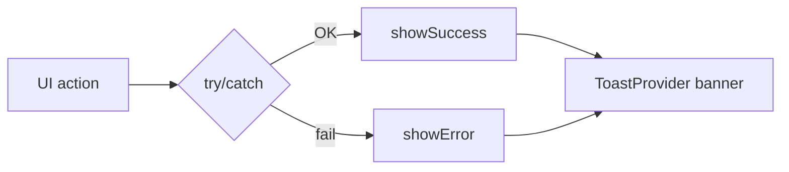

# Mobile UX Feedback (Toast)

Phản hồi người dùng thống nhất trên mobile qua toast toàn app.

## Mục đích

- Mọi mutation (lưu, đồng bộ, mở Maps/Gọi) có success hoặc error rõ ràng.
- Tránh fail im lặng (đặc biệt Maps, gọi điện, sync).

## Luồng

## Code

| Thành phần | Path |
|------------|------|
| Provider | [mobile/src/components/ui/ToastProvider.tsx](../../mobile/src/components/ui/ToastProvider.tsx) |
| Root wrap | [mobile/app/_layout.tsx](../../mobile/app/_layout.tsx) |
| Hook | `useToast()` → `showSuccess`, `showError` |

## Bảng message (P1)

| Màn / action | Success | Error |
|--------------|---------|-------|
| Staff: lưu ghi chú, voice, hoàn thành | Có | Sync / network |
| Staff: Maps, Gọi | (Maps mở OK im lặng hoặc lỗi) | Không mở được Maps / Gọi |
| Admin: lưu kiểm kê | Đã lưu / xếp hàng offline | Lưu thất bại |
| Admin: sửa đơn / hoàn thành list | Đã cập nhật / hoàn thành | Cần mạng / PATCH lỗi |
| Admin: thu nợ | Đã thu nợ | Cần mạng / số tiền không hợp lệ |
| Admin: +1 vỏ, pull sync | Đã +1 vỏ / đồng bộ | Đồng bộ thất bại |
| Admin: pull Tổng quan / Đơn hàng | Đã đồng bộ | Đồng bộ thất bại |
| Login | (inline error giữ nguyên) | Network + toast tùy case |

## Liên kết

- [staff-delivery](./staff-delivery.md)
- [admin-mobile](./admin-mobile.md)
