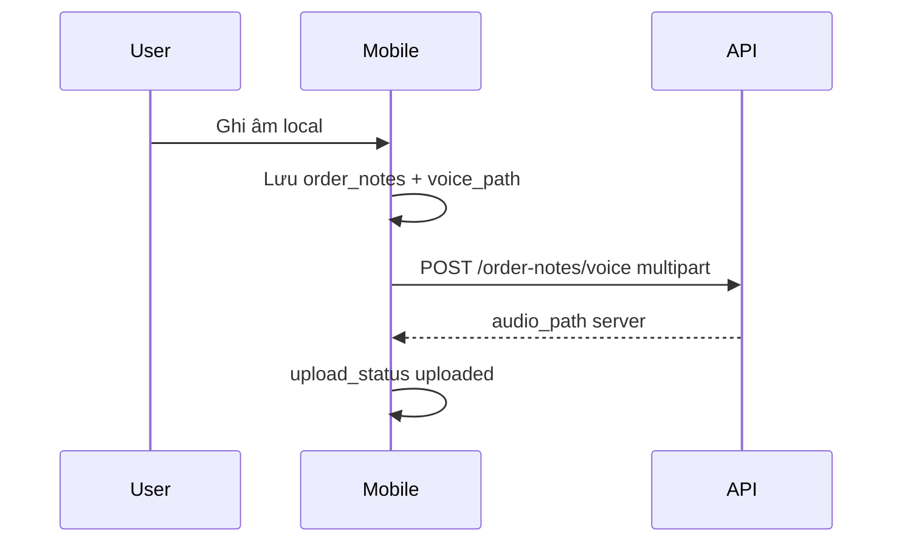

# Order Notes & Voice

Ghi chú text/voice gắn quy trình giao hàng.

## Mục đích

- Ghi nhanh thông tin đơn (text hoặc ghi âm).
- Voice upload lên server, phát qua `/media/...`.

## Actor

admin và user — mỗi user thấy notes do mình tạo (staff pull filter).

## Luồng voice

## API

| Method | Path |
|--------|------|
| GET/POST/PATCH/DELETE | `/order-notes` |
| POST | `/order-notes/voice` |

## DB

- Server: `order_notes` — [relations §4](../database/relations-postgresql.md#4-order-notes)
- Mobile: `order_notes.sales_order_id` logical FK

## Web

- `/ghi-chu-giao`, tích hợp trong `/don-hang`

## Mobile

- Tab **Ghi chú** staff: [StaffNotesPanel.tsx](../../mobile/src/features/staff/StaffNotesPanel.tsx) — UI giống web (text + ghi âm, badge Chữ/Ghi âm, xóa có confirm).
- **Local-first:** text + voice lưu SQLite ngay (user đỡ quên); sync nền khi có mạng (outbox text, `voice-upload` voice) — không hiển thị trạng thái pending.
- Chi tiết đơn: [StaffOrderDetailPanel.tsx](../../mobile/src/features/staff/StaffOrderDetailPanel.tsx) — ghi chú gắn `sales_order_id`.
- Voice upload: [mobile/src/sync/voice-upload.ts](../../mobile/src/sync/voice-upload.ts) (gửi kèm `duration_sec`).
- Toast success/error sau lưu text, voice, permission mic — [mobile-ux-feedback.md](./mobile-ux-feedback.md)

## Edge cases

- Offline: note local + sync push text trước; voice upload khi có mạng.
- `parser_status` stub cho STT/LLM tương lai.
- Permission mic từ chối → toast, không fail im lặng.
