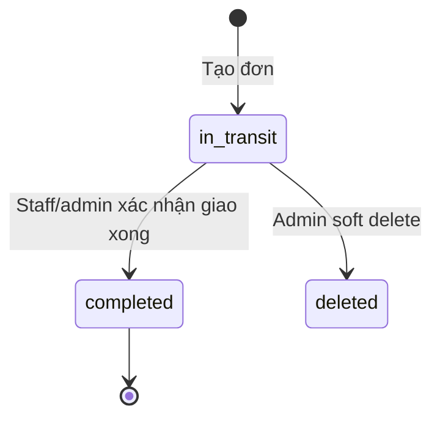
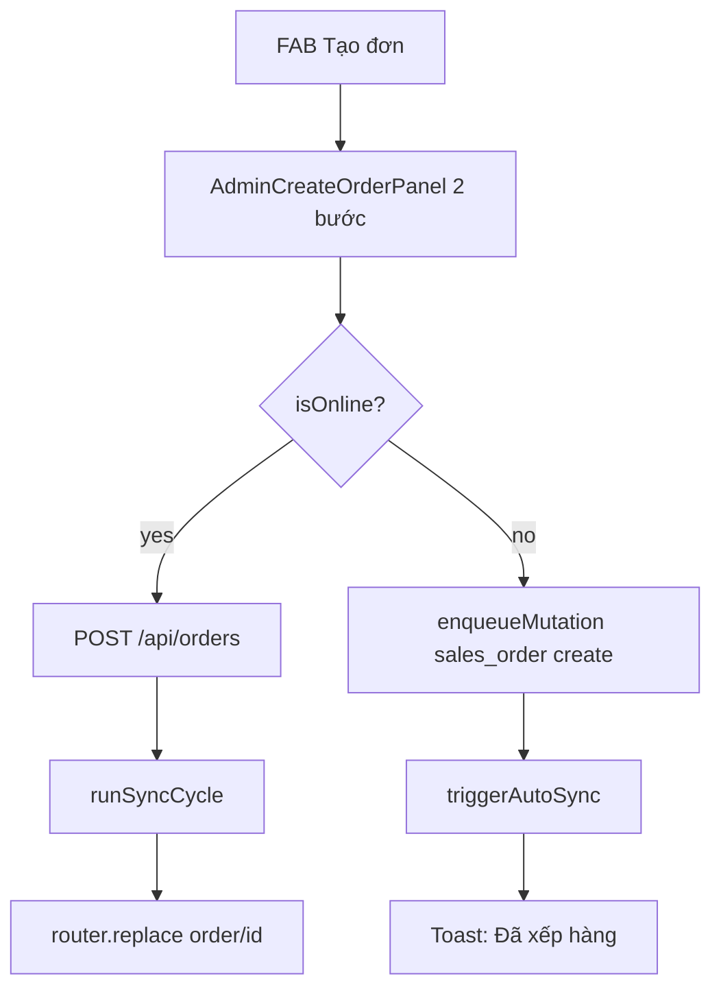
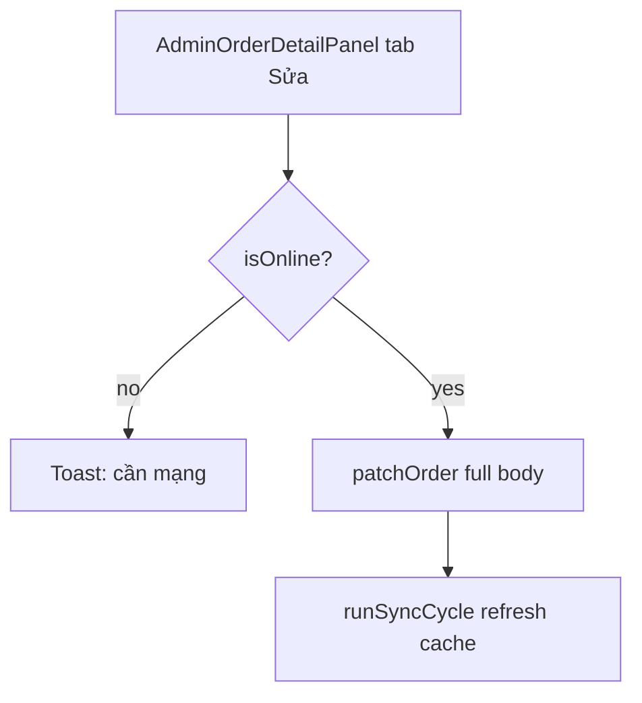

# Orders & Delivery

Quản lý đơn bán hàng và trạng thái giao.

## Mục đích

- Admin tạo/sửa/xóa đơn; tính VAT, công nợ, vỏ mượn.
- Staff giao hàng — cập nhật trạng thái `completed`.

## Actor

| Thao tác | admin | user |
|----------|-------|------|
| CRUD đơn (admin API) | ✓ | ✗ |
| Xem/sửa đơn được giao | ✓ | ✓ |
| Hoàn thành giao | ✓ | ✓ (đơn của mình) |

## Order lifecycle

## API

| Method | Path | Auth |
|--------|------|------|
| GET/POST/PATCH/DELETE | `/orders` | admin |
| GET/PATCH | `/me/orders` | user |

→ [endpoints.md](../api/endpoints.md)

## DB

- `sales_orders`, `sales_order_items`, `order_change_log` — [relations §3](../database/relations-postgresql.md#3-orders-core)

## Web

- Admin: `/don-hang` — ô tìm mã/khách/SĐT (debounce ~300ms), server filter `GET /orders?q=`, phân trang đúng `total`
- Staff history: `/don-cua-toi`

## Mobile

- Staff list: `(staff)/(tabs)/index.tsx`
- Staff detail: `(staff)/order/[id].tsx`
- Admin: `(admin)/(tabs)/orders.tsx`, `(admin)/order/[id].tsx`
- Admin create: `(admin)/order/create.tsx` (FAB tab bar → stack)

### Admin mobile create (online + offline)

- Mẫu chai: owner mặc định **Gas Huy Hoàng**, serial không bắt buộc; preset chỉ owner + ngày kiểm/nhập (web + mobile).
- Products phải đã pull vào SQLite; nếu trống → toast “đồng bộ kho trước”.

### Admin mobile P1 (online PATCH)

- Field sửa: `delivery_status`, `phone`, `note`, `assigned_to_user_id`.
- List quick action **Hoàn thành** — cùng PATCH flow.
- Staff complete vẫn dùng outbox `{ delivery_status: completed }`.

## Edge cases / offline

- Mobile complete đơn → outbox push `delivery_status: completed`.
- Soft delete: `deleted_at` — pull gửi `op=delete`; mobile reconcile qua `/sync/sales-order-ids`.
