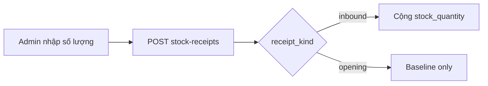

# Products & Inventory

Quản lý catalog sản phẩm và nhập kho.

## Mục đích

- CRUD sản phẩm gas (giá, tồn, ngưỡng cảnh báo).
- Nhập kho qua stock receipts — không sửa `stock_quantity` trực tiếp qua PATCH.

## Actor

| Thao tác | admin | user |
|----------|-------|------|
| Xem products | ✓ | ✓ |
| CRUD product | ✓ | ✗ |
| Nhập kho | ✓ | ✗ |

## Luồng nhập kho

## API

| Method | Path |
|--------|------|
| GET/POST/PATCH/DELETE | `/products` |
| GET/POST | `/products/{id}/stock-receipts` |

→ [endpoints.md](../api/endpoints.md)

## DB

- `products`, `stock_receipts` — [relations §2](../database/relations-postgresql.md#2-catalog--inventory)

## Web

- Route: `/kho` — [navGroups](../../frontend/src/lib/navGroups.ts)

## Mobile

- Admin module: [mobile/app/(admin)/module/inventory.tsx](../../mobile/app/(admin)/module/inventory.tsx)
- Pull cache: `products` entity sync

## Edge cases

- PATCH product báo lỗi nếu cố cập nhật tồn trực tiếp — phải dùng stock-receipts.
