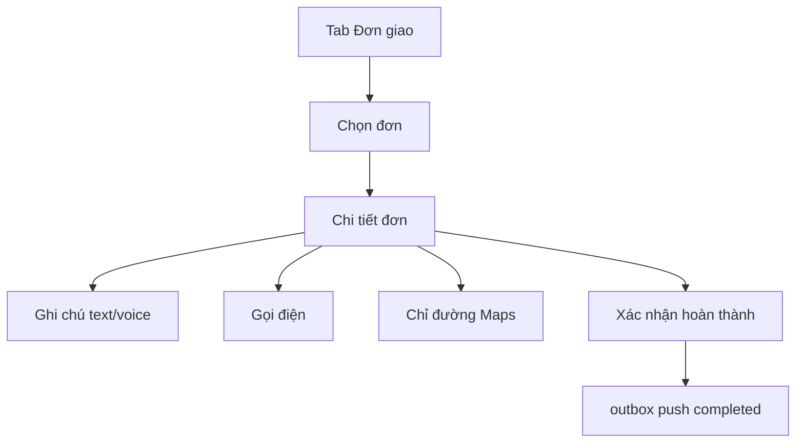

# Staff Delivery

Luồng nhân viên giao hàng trên web và mobile.

## Mục đích

- Xem danh sách đơn được giao.
- Ghi chú, gọi KH, chỉ đường, xác nhận hoàn thành.

## Actor

Role `user` (staff).

## Staff flow

## API

| Method | Path |
|--------|------|
| GET/PATCH | `/me/orders` |
| GET/POST | `/order-notes`, voice |
| GET | `/sync/pull`, POST `/sync/push` |

## DB

- `sales_orders` (assigned_to, delivery_status)
- Local mirror — [mobile-sqlite.md](../database/mobile-sqlite.md)

## Web

- `/don-cua-toi`, `/ban-do`, `/ghi-chu-giao`

## Mobile

| Route | File |
|-------|------|
| Danh sách | `(staff)/(tabs)/index.tsx` |
| Điểm giao | `(staff)/(tabs)/directions.tsx` |
| Chi tiết | `(staff)/order/[id].tsx` |

Features: [mobile/src/features/staff/](../../mobile/src/features/staff/)

Design: [mobile/design-system/pages/staff-directions.md](../../mobile/design-system/pages/staff-directions.md)

### Toast (P1)

Mọi action staff (ghi chú, voice, hoàn thành, Maps, gọi) dùng `useToast()` — xem [mobile-ux-feedback.md](./mobile-ux-feedback.md).

## Edge cases

- Offline complete → queue outbox; sync khi có mạng.
- Đơn không assigned → fallback creator filter (sync engine).
- Mic permission denied → toast error.
- Gọi điện trên emulator thường fail — test trên máy thật.
