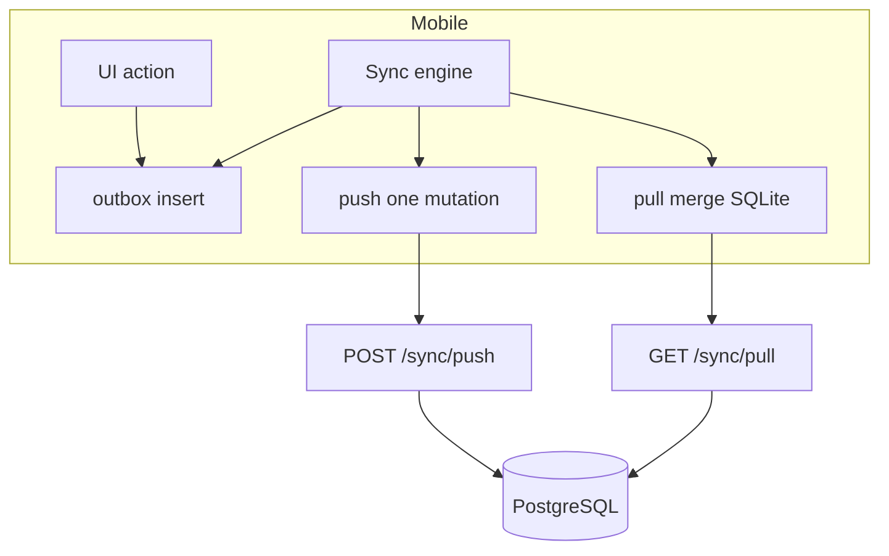

# Sync Offline (Mobile)

Outbox queue, pull/push, conflict handling.

## Mục đích

- Staff/admin làm việc khi mất mạng.
- Đồng bộ an toàn ACID + idempotent trên server.

## Actor

Mobile users (admin + staff).

## Full sync cycle

## API

→ [api/sync.md](../api/sync.md)

## DB

- Server: `sync_applied_mutations`
- Mobile: `outbox`, `sync_meta` — [mobile-sqlite.md](../database/mobile-sqlite.md)

## Mobile

- Engine: [mobile/src/sync/engine.ts](../../mobile/src/sync/engine.ts)
- Outbox UI: [mobile/app/outbox.tsx](../../mobile/app/outbox.tsx)
- ConflictSheet, SyncStatusBar trong features

## ADR

→ [adr-mobile-sync.md](../adr-mobile-sync.md)

## Edge cases

- Single-flight push — tránh duplicate mutation.
- Session expired during sync → login lại.
- Voice upload tách khỏi JSON push.

## Manual pull sync theo tab (v5.3)

| Tab / màn | Pull refresh | Toast |
|-----------|--------------|-------|
| Admin Tổng quan | ✓ | Đã đồng bộ / lỗi |
| Admin Đơn hàng | ✓ (+ nút Đồng bộ) | Đã đồng bộ / lỗi |
| Staff đơn / điểm giao | ✓ | (theo màn) |
| Outbox | ✓ + nút | (theo màn) |

Không bật sync tự động ngay sau login — user chủ động kéo xuống khi cần.
