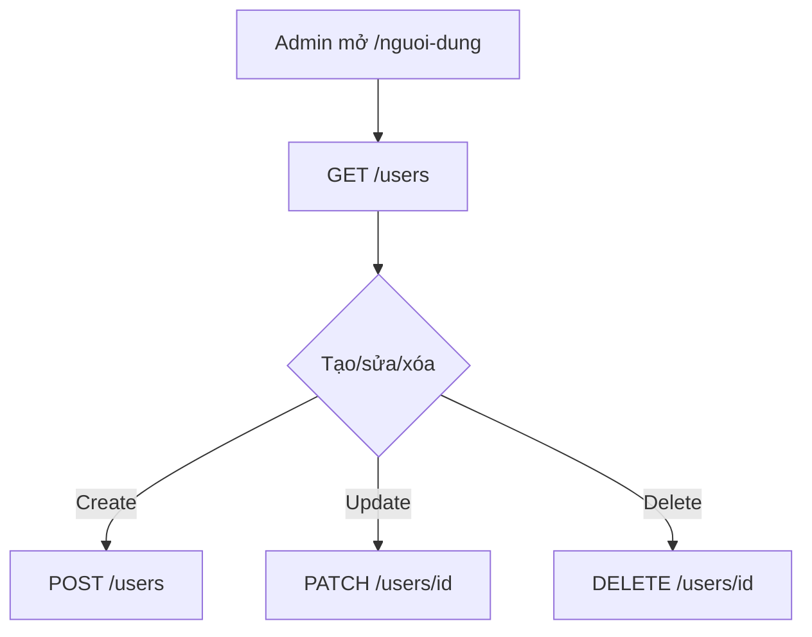

# Users Admin

Quản lý tài khoản người dùng.

## Mục đích

- CRUD user, đổi role, bật/tắt `is_active`.
- Seed admin mặc định lúc startup.

## Actor

Admin only.

## Luồng CRUD

## API

| Method | Path |
|--------|------|
| GET/POST/PATCH/DELETE | `/users` |

## DB

- `users`, `refresh_tokens` — [relations §1](../database/relations-postgresql.md#1-auth--users)

## Web

- `/nguoi-dung`

## Mobile

- [mobile/app/(admin)/module/users.tsx](../../mobile/app/(admin)/module/users.tsx)

## Edge cases

- Default admin `admin`/`admin123` — đổi khi deploy production.
- Revoke refresh tokens khi disable user (via auth service).
