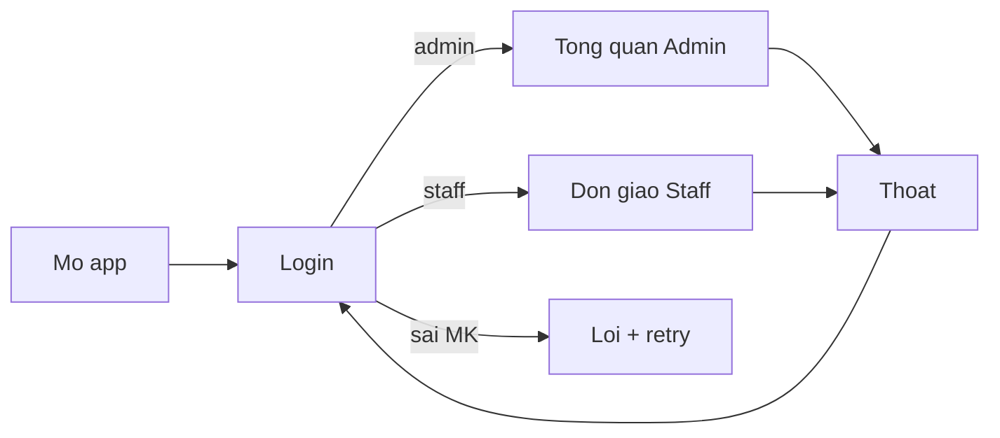
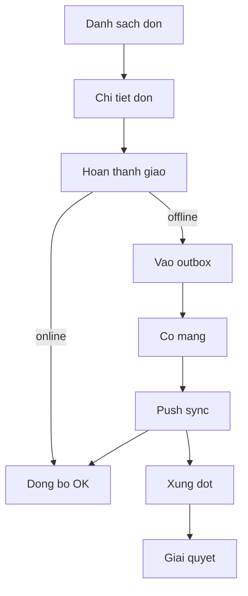
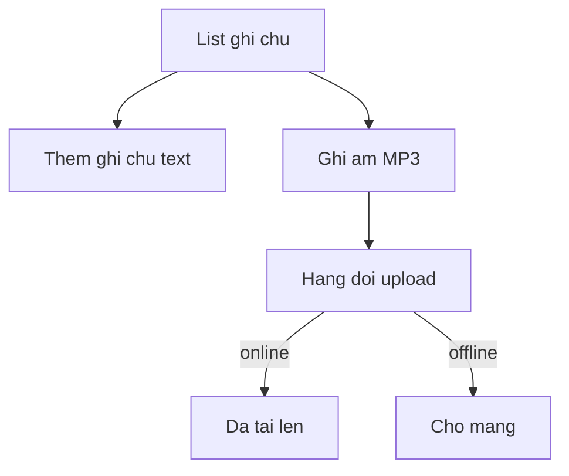
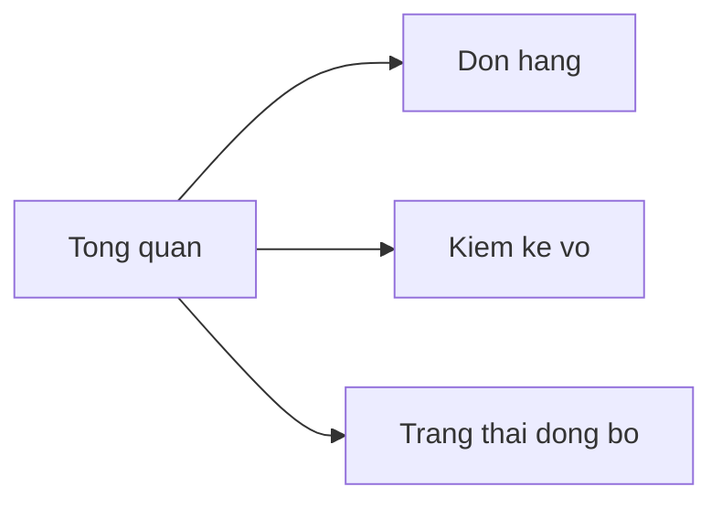
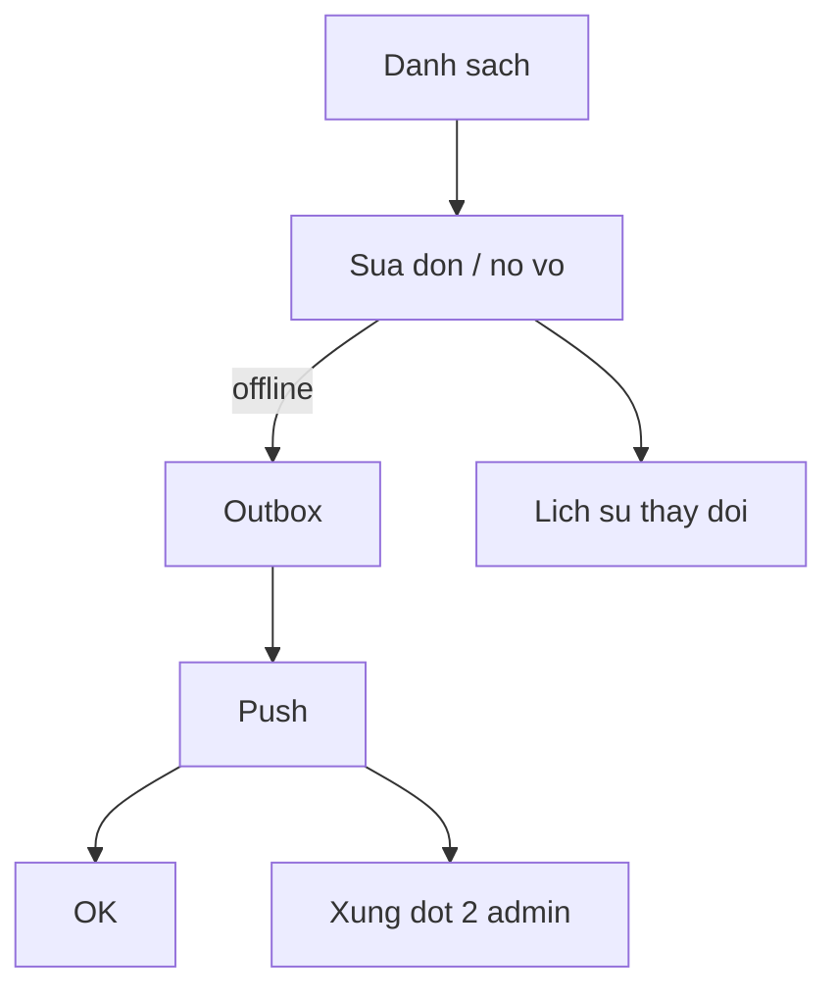
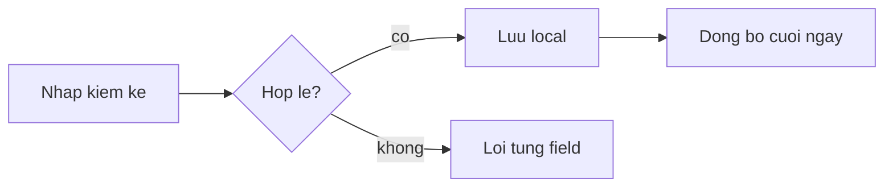

# Gas Store Mobile — Figma Blueprint (v1)

> **Mục tiêu:** Dựng và duyệt **toàn bộ business flow trên Figma** trước khi Code Connect / implement RN / diagram FigJam.
>
> **Không dùng (giai đoạn này):** `figma-generate-design`, `figma-code-connect`, `figma-generate-diagram`.
>
> **Design tokens:** đọc `gas-store-mobile/MASTER.md` (ui-ux-pro-max). Override theo màn → `pages/*.md`.

---

## 1. Thiết lập file Figma

| Mục | Giá trị |
|-----|---------|
| **File Figma** | [Gas-store](https://www.figma.com/design/YqysrxDyidLcMiXb3iL4Wv/Gas-store?node-id=0-1) (`fileKey`: `YqysrxDyidLcMiXb3iL4Wv`) |
| Page hiện tại | `Gas Store Mobile v1` (Starter plan: **tối đa 3 pages** — dùng **Section** trong 1 page) |
| Scope v1 | **Staff + Admin** (P0 flows) |
| Dark mode | **Không** (light only) |
| Logo | `logo.png` (repo root) — đã upload Figma (`node-id=6-2`, `imageHash` on file) |
| Frame mặc định | **390 × 844** (Android phone) |
| Grid | 8dp baseline, margin ngang **16dp** |
| Font | Inter (body/UI), Calistoga chỉ hero/marketing nếu cần |
| Icon | Lucide hoặc Ionicons outline — **một style**, không emoji |
| Ngôn ngữ copy | **Tiếng Việt** |
| Theme v1 | **Light only** (dark mode phase 2) |

### Bố cục canvas — **1 page duy nhất** (Starter / không trả phí)

**Chỉ dùng page `Gas Store Mobile v1`.** Không tạo page mới. Chia bằng **Section** xếp ngang:

| Section | Nội dung |
|---------|----------|
| `00 Cover` | Logo + token swatches + legend |
| `01 Components` | Button, Input, SyncBanner, OrderCard, TabBar, … |
| `02 Auth` | Login (+ error state) |
| `03 Staff` | Orders list/detail, Notes, Map placeholder |
| `04 Admin` | Dashboard, Orders, Audit |
| `05 System` | Offline, sync, conflict, empty |
| `06 Flows` | Mermaid stickies / connector giữa frame |

Mỗi màn hình = frame **390×844** đặt trong section tương ứng.

---

## 2. Variables (Figma)

Tạo collection **Semantic** (alias tới primitive nếu có library):

| Token | Hex | Dùng cho |
|-------|-----|----------|
| `color/primary` | `#2563EB` | Header, link, tab active |
| `color/accent` | `#F97316` | Primary CTA |
| `color/bg` | `#F8FAFC` | Screen background |
| `color/surface` | `#FFFFFF` | Card, sheet |
| `color/text` | `#1E293B` | Body |
| `color/text-muted` | `#64748B` | Caption |
| `color/border` | `#E2E8F0` | Divider |
| `color/success` | `#16A34A` | Hoàn thành, online |
| `color/warning` | `#D97706` | Chờ sync, pending |
| `color/error` | `#DC2626` | Lỗi, conflict |
| `space/4` … `space/48` | 4–48dp | Padding, gap |
| `radius/sm` | 8 | Button, input |
| `radius/md` | 12 | Card |
| `radius/lg` | 16 | Bottom sheet |

---

## 3. Component library (Page `01 — Components`)

Build **trước** khi vẽ màn hình. Mỗi component = Component Set có variant.

| Component | Variants / states | Ghi chú UX |
|-----------|-------------------|------------|
| **Button** | primary / secondary / ghost / danger × default / pressed / disabled / loading | CTA chính = accent; min height **48dp** |
| **TextField** | default / focus / error / disabled | Label **luôn hiện**, không placeholder-only |
| **AppBar** | staff / admin / modal (back) | Safe area top |
| **BottomTab** | 2–3 tab staff, 3 tab admin | Icon + label; max 5 tab |
| **SyncBanner** | online / offline / syncing / error | Luôn ở dưới status bar; icon + text, không chỉ màu |
| **OrderCard** | pending / in-transit / completed / conflict | Badge trạng thái + địa chỉ + số chai |
| **MetricCard** | default / accent / warning / success | Admin dashboard |
| **Badge** | status colors | Đi kèm text (VD: "Đang giao") |
| **EmptyState** | no-orders / no-network / no-notes | Illustration optional; 1 CTA |
| **ListRow** | default / chevron / switch | Quick actions admin |
| **BottomSheet** | confirm / form | Swipe dismiss + nút đóng |
| **Toast** | success / error / info | Không che tab bar |
| **VoiceNoteRow** | idle / recording / queued / uploaded | Staff ghi chú |
| **ConflictPanel** | side-by-side hoặc stacked | Server vs local |

---

## 4. Business flows — thứ tự duyệt

Duyệt **theo flow**, không theo từng màn lẻ. Mỗi flow = một hàng frame trên Figma + connector hoặc sticky số bước.

### Flow A — Auth (P0)

**Frames:** `Auth / Login`, `Auth / Login — Error`, `Auth / Loading`

Spec chi tiết: `pages/auth-login.md`

---

### Flow B — Staff: Đơn giao + offline (P0)

**Frames:**

| # | Frame name | Trạng thái |
|---|------------|------------|
| B1 | `Staff / Orders — List` | Có đơn |
| B2 | `Staff / Orders — List Empty` | |
| B3 | `Staff / Orders — List Offline` | Banner offline |
| B4 | `Staff / Order Detail` | |
| B5 | `Staff / Complete Delivery — Confirm` | Bottom sheet |
| B6 | `Staff / Complete — Success` | Toast |
| B7 | `Staff / Sync — Pending` | Badge outbox |
| B8 | `Staff / Conflict — Order` | |

Spec: `pages/staff-orders.md`, `pages/sync-states.md`

---

### Flow C — Staff: Ghi chú + voice queue (P0)

**Frames:** `Staff / Notes — List`, `Staff / Notes — Add`, `Staff / Notes — Recording`, `Staff / Notes — Queue`

Spec: `pages/staff-notes.md`

---

### Flow D — Staff: Điểm giao → Google Maps (P0)

**Không nhúng map SDK.** Chỉ list đơn + nút mở app ngoài.

**Frames:** `Staff / Directions — List`, `Staff / Order Detail — Chỉ đường`

Deep link: `google.com/maps/dir/?api=1&destination=lat,lng` hoặc địa chỉ text.

Spec: `pages/staff-directions.md` (v4 capture)

---

### Flow E — Admin: Tổng quan (P0)

**Frames:** `Admin / Dashboard`, `Admin / Dashboard — Pending sync`

Spec: `pages/admin-dashboard.md`

---

### Flow F — Admin: Đơn hàng + sửa offline (P0)

**Frames:** `Admin / Orders — List`, `Admin / Order — Detail`, `Admin / Order — Edit`, `Admin / Order — Change log`

Spec: `pages/admin-orders.md`

---

### Flow G — Admin: Kiểm kê vỏ/nước UTC+7 (P0)

**Frames:** `Admin / Audit — Form`, `Admin / Audit — Validation error`, `Admin / Audit — Saved offline`

Spec: `pages/admin-audit.md`

---

### Flow H — Admin parity (P2 — sau khi P0 ổn)

Map 1:1 với web `navGroups.ts`:

| Web | Mobile frame (đặt tên sẵn) |
|-----|----------------------------|
| Vận hành hằng ngày | `Admin / Operations` |
| Công nợ | `Admin / Debt` |
| Đòi nợ | `Admin / Collection` |
| Báo cáo thuế | `Admin / Tax report` |
| CSKH | `Admin / CRM` |
| Sổ gas | `Admin / Cylinder ledger` |
| Kho | `Admin / Inventory` |
| Mẫu chai | `Admin / Bottle templates` |
| Users | `Admin / Users` |

---

## 5. Navigation map

### Staff (bottom tab — 3 item)

| Tab | Label | Icon gợi ý |
|-----|-------|------------|
| 1 | Đơn giao | `bicycle` / `package` |
| 2 | Điểm giao | `map-pin` / `navigate` — mở Google Maps, không nhúng map |

### Admin (bottom tab — 3 item v1, mở rộng drawer sau)

| Tab | Label |
|-----|-------|
| 1 | Tổng quan |
| 2 | Đơn hàng |
| 3 | Kiểm kê |

Menu phụ (overflow / drawer phase 2): Công nợ, Kho, Users, …

---

## 6. Checklist duyệt flow (sign-off)

Trước khi code lại RN, mỗi flow cần tick:

- [ ] Copy tiếng Việt đúng nghiệp vụ (nợ vỏ, kiểm kê, đòi nợ…)
- [ ] Touch target ≥ 48dp; tab bar không che CTA
- [ ] Offline banner + pending badge nhất quán mọi màn
- [ ] Empty / error / loading cho mỗi list
- [ ] Conflict UI: user hiểu chọn bản nào
- [ ] Một primary CTA rõ mỗi màn
- [ ] Safe area (status bar, gesture bar)
- [ ] Màu trạng thái có icon + text (không chỉ màu)

---

## 7. Lộ trình đề xuất (chờ bạn confirm)

| Tuần | Việc Figma |
|------|------------|
| 1 | Tokens + Components + Auth + Sync states |
| 2 | Staff flows B + C (full) |
| 3 | Admin E + F + G |
| 4 | Review parity list H + chỉnh theo feedback |

**Sau sign-off:** mới bật Code Connect + implement RN theo frame.

---

## 8. Trạng thái & cách làm (free / Starter)

| | |
|---|---|
| **Quy tắc** | **Chỉ 1 page** — mọi flow nằm trong Section trên `Gas Store Mobile v1` |
| **Guide chi tiết** | [`SINGLE-PAGE-GUIDE.md`](./SINGLE-PAGE-GUIDE.md) — frame-by-frame, components, checklist |
| **Đã có trên file** | Variables `Gas Store Mobile`, logo `6:2`, page renamed |
| **Figma MCP** | `use_figma` hết quota Starter; dùng **`generate_figma_design`** từ HTML mockup |
| **Capture mới nhất** | v4 final: `figma-mockup/index-v4-final.html` · v2 [12:2](https://www.figma.com/design/YqysrxDyidLcMiXb3iL4Wv/Gas-store?node-id=12-2) · v3 [14:2](https://www.figma.com/design/YqysrxDyidLcMiXb3iL4Wv/Gas-store?node-id=14-2) · chi tiết: `FIGMA-STATUS.md` |

**Không cần trả phí Figma** để duyệt flow: Starter + 1 page + Section + vẽ tay là đủ.
